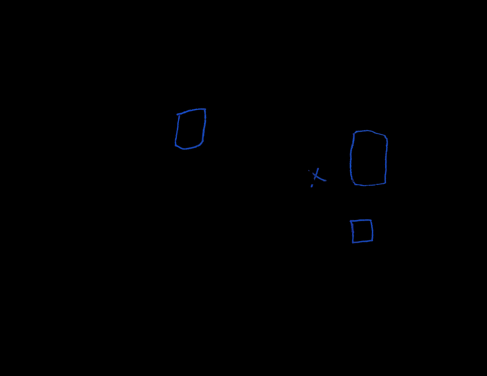

# Automating the Digitization of Drawn Figures on Printed Maps

This is the demo of an internship research project, conducted during my time at Microsoft as a Software Engineering Intern under the Cloud Advocacy Academic Team. The goal of the project was to extract hand-drawn shapes from printed maps, and digitize them into usable digital formats (GEOjson in this case).

## About the Project

The research for this project started with the goal of assisting the **Action Mapping Project (AMP)**, conducted by researchers of the University of Washington, Tacoma by automating the process of digitization of data.

You can read more about the Action Mapping Project in their website here: https://actionmappingproject.com/

### Current Sample Input/Ouput

*Sample Map. Source: [Action Mapping Project](https://actionmappingproject.com/)*

*Blue Shapes*

*Red Shapes*

## Setting Up

This demo is built for use in Azure Machine Learning Notebooks, storing the data in Azure Storage. To create these resources, first you will need an Azure account.

- You can sign up for free and get $200 of credit to use for 30 days and 12 months of free services [**here**](https://azure.microsoft.com/free/?WT.mc_id=mapdigitdemo-github-cxa).
- If you are a student, you have access to $100 of credit and free services for a year, renewable yearly as long as you are a student, without needing a credit card [**here**](https://azure.microsoft.com/free/students/?WT.mc_id=mapdigitdemo-github-cxa).

Once your account is created, the next step is creating an Azure ML resource, and an Azure Storage account. You can follow these links for guides on how to do each:
- [Creating an Azure ML resource](./azureml_rsc.md).
- [Creating an Azure Storage account, and creating a Blob Storage container](./azurestg_blob.md).

## Running the Demo

To run this demo, you will first need to create a Data Store from our Blob Storage. You will also need access to your **Subscription ID, Storage Account Name, Blob Container Name and Account Key**.

- For your **Subscription ID**, you can go to the [Azure Portal](https://portal.azure.com//?WT.mc_id=mapdigitdemo-github-cxa) and select **Subscriptions**. 

- Likewise, accesing your **Storage Account** from the [Azure Portal](https://portal.azure.com//?WT.mc_id=mapdigitdemo-github-cxa), will let you find your **Access Key**. 

    

There is many ways to create a Data Store, which can be found here:

[**How to Access Data**](https://docs.microsoft.com/azure/machine-learning/how-to-access-data?WT.mc_id=mapdigitdemo-github-cxa)

I recommend following the steps under **Azure Machine Learning studio**. 

With the Data Store set up, we can move on to the [**code**](./digitization_demo.ipynb)
