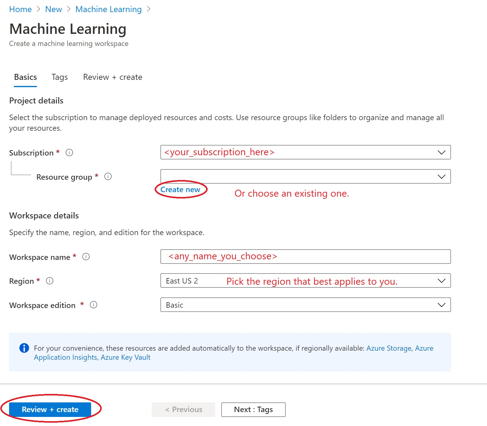
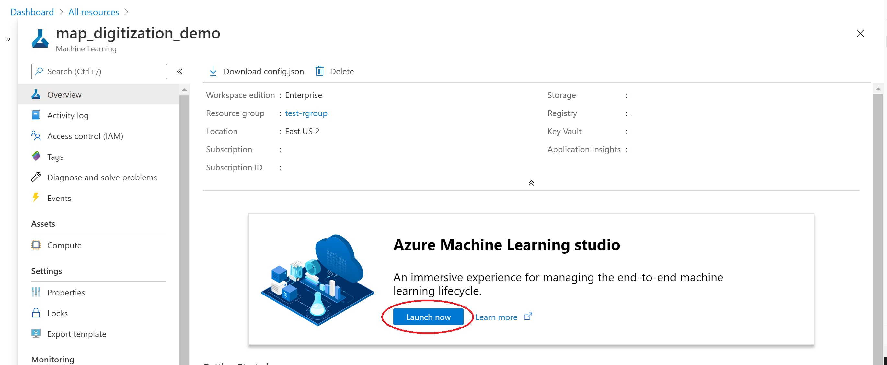

# Creating an Azure Machine Learning Resource

This project was created with the use Azure ML notebooks in mind, as it aims to incorporate training models in the future. To bring this project to work, we must first create an Azure Machine Learning workspace.

1. Sign in to the [**Azure Portal**](https://portal.azure.com//?WT.mc_id=mapdigitdemo-github-cxa) using the credentials for the account you created.
2. In the upper-left corner, select the pluys symbol (**Create a resource**)

     
    *Figure 1. Creating a ML resource. Source: [Azure ML Docs](https://docs.microsoft.com/azure/machine-learning/tutorial-1st-experiment-sdk-setup)*

3. Find Machine Learning and select it.
4. In the Machine Learning pane, select Create to begin.
5. Fill in the details as follows:

    

6. Wait for the resource to finish deployment.

## Preparing our workspace in Azure ML Studio.

Once our workspace is deployed, we can access it through our Dashboard. 

Here we can launch Azure ML Studio by clicking on **Launch Now** at the center of the resource page.

1. Once in ML Studio, we will navigate to **Notebooks**. Here you will see both **Sample** notebooks, and **My Files**.
2. For the time being, we will choose **My Files**.
3. Click on the upload button, and upload the Jupyter Notebook (.ipynb) file. 
4. That's it for setting up our Azure ML Workspace!
