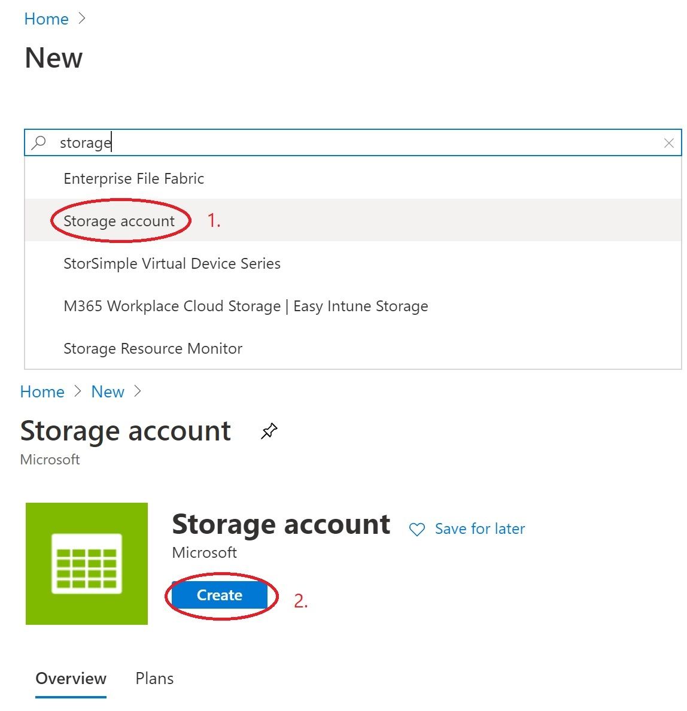
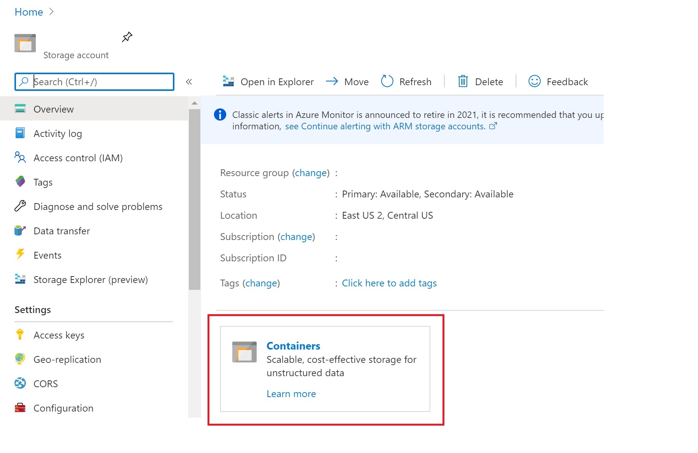

# Creating an Azure Blob Storage and Uploading our Data

To store and access our data from Azure ML, we will be creating an Azure Storage Account. Since our dataset will be composed of images, we will be creating a Blob storage. A blob storage is optimized for storing unstructured data, that is data that does not adhere to a particular model.
If you wish to read learn more about blob storage, you can go check [*Azure Blob Storage Documentation](https://docs.microsoft.com/azure/storage/blobs/storage-blobs-introduction?WT.mc_id=mapdigitdemo-github-cxa)

## Creating our storage account

1. Sign in to the [**Azure Portal**](https://portal.azure.com//?WT.mc_id=mapdigitdemo-github-cxa) using the credentials for the account you created.

2. In the upper-left corner, select the pluys symbol (**Create a resource**).
    

3. Search and select **Storage Account**, then click **Create**.

    

4. Select your subscription and your resource group (selecting the one you created for the Azure ML workspace is recommended). Write a name of your liking, select the location that best applies to you and select **BlobStorage** under Account Kind.

    

5. Click on **Review + Create** 

6. You are set! Wait for the deployment to complete and you will be ready to create your containers.

## Creating a container for your data

1. Once the resource has been deployed, we can create a blob container. You can access your containers through the resource's page.

    

2. To create a new container, click on **+ Create** on the upper left corner. Type your container name on the pop-up bar that appears to the right side of the screen and click create.

    

3. Once your container is created, you can upload the data directly from your local files. Click on **Upload** on the upper left corner, then select your files on the pop-up bar. Click once again on **Upload** and wait for the files to finish uploading.

    

4. That's it! You are ready to move on with the project. 

[**<< Go Back**](./README.md)
